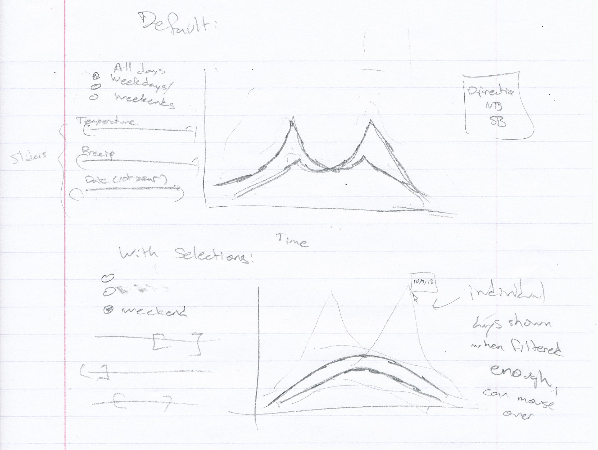

a3-nkullman-gclenagh
===============

## Team Members

1. Nick Kullman nkullman@uw.edu
2. Graham Clenaghan clenagh@math.washington.edu

## Bike Activity on the Fremont Bridge

### Visualization
- Visualization shows records of cyclist counts across the Fremont Bridge.
- Records from each calendar day are mapped to two lines on the visualization showing northbound and southbound counts at each hour.
- Sliding brushes allow the viewer to select a subset of daily records according to specific values of the following:
  - Max temperature
  - Daily precipitation
  - Day of the year
- Viewers can choose between weekdays/weekends through use of a radio button.
- Visualization reports number of days currently shown in gray area beneath the bank of controls.
- Emphasized lines show hourly counts for all days in the viz aggregated by date for each direction of cyclist traffic.
- Hovering over a non-aggregate line displays the day's date, maximum temperature, and amount of precipitation

### Dataset
- Two primary data sources for this assignment:
  1. Fremont Bridge bicycle count data from the City of Seattle[(https://data.seattle.gov/)](https://data.seattle.gov/Transportation/Fremont-Bridge-Hourly-Bicycle-Counts-by-Month-Octo/65db-xm6k)
  2. Weather data from [WeatherUnderground](http://www.wunderground.com/)
- Bike data are hourly counts of cyclists crossing the east (northbound) and west (southbound) sides of the Fremont Bridge in Seattle, WA from October 2012 - April 2015.
- Weather data are daily aggregates of a number of meteorological variables over the same time span.
- Datasets were merged and cleaned. Tuples in the final dataset are of the following format:

| Index | Date | Time | Direction | CyclistCount | IsWeekday | Max_TemperatureF | PrecipitationIn | daynum |
| ----- | ---- | ---- | -------- | ----------- | ------- | --------------------- | ------------------- | ------ |
| 1 | 2012-10-02 | 0 | "NB" | 0 | TRUE | 63 | 0 | 275 |

 
<!--- (Put a brief description of your final interactive visualization application and your dataset here.) --->

## Running Instructions

<!--- Put your running instructions here. (Tell us how to run your visualization.) --->

You can access our visualization at [http://cse512-15s.github.io/a3-nkullman-gclenagh/](http://cse512-15s.github.io/a3-nkullman-gclenagh/) or download this repository and run `python -m SimpleHTTPServer 9000` and access this from http://localhost:9000/.

Within the visualization, the following interactivity controls are at your disposal:
- A brush to select a range of maximum daily temperatures
- A brush to select a range of daily precipitation amounts
- A brush to select a range of calendar days
- A radio button to select only weekdays or weekends
For each brush, the brushed selection can be narrowed/widened and translated. 

Any time a selection is made with these controls, the visualization is updated to show only those days matching the selected criteria. The aggregated lines are recalculated and repainted based on selection, 
and the board showing the number of days in the display is also recalculated.
Details about each non-aggregate line on the graph are available through hovering.

## Story Board

We provide the viewer with a visualization of Seattleites' cycling tendencies.
We allow the viewer to explore how cyclist turnout varies throughout the day and how turnout is affected by environmental factors. 
Driving the interactivity controls on our visualization is the question "how do temperature and precipitation affect the amount of cycling activity?"

<!--- Put either your storyboard content or a [link to your storyboard pdf file](storyboard.pdf?raw=true) here.
Just like A2, you can use any software to create a *reasonable* pdf storyboard. --->

### Changes between Storyboard and the Final Implementation

Only two differences exist between our storyboard and final implementation:
1. Our legend moved to the left of the display.
2. In addition to the aggregate lines, we also chose to display lines for individual days
  - This was absent from the original storyboard out of fear of a cluttered display, but we conquered the clutter through adjustment of opacity and line thickness.

<!--- A paragraph explaining changes between the storyboard and the final implementation. --->

## Development Process

After obtaining and processing the data as above, a mockup of the design was put together in R/Shiny, which can be seen [here](https://gclenaghan.shinyapps.io/fremont/). To implement the visualization in D3, Graham focused on the layout, selection tools, and data processing, while Nick focused on the graphic itself. We estimate it took about 15 hours/person, with a bulk of the time going to learning the basics of Javascript and D3, since neither group member had previous experience with web development.
